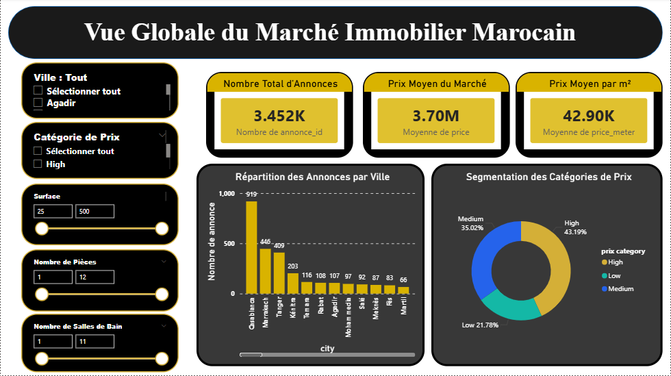
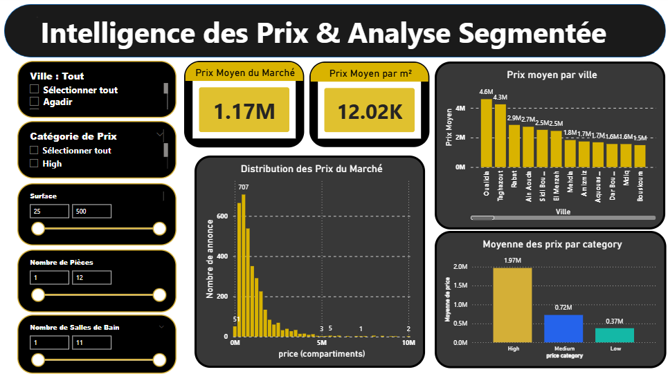
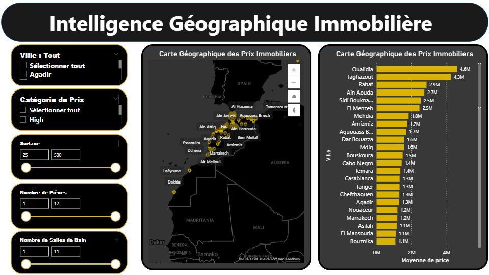

# Avito Real Estate Analytics — Power BI Dashboard Suite

> An end-to-end business intelligence solution analyzing **3,403 Moroccan real estate listings** sourced from Avito.ma. Built on a production-grade data pipeline, this report delivers market intelligence across three interactive dashboards covering pricing, segmentation, and geographic distribution.

**Pipeline Repository:** [avito-end-to-end-data-pipeline](https://github.com/ayoub-data-analyst/avito-end-to-end-data-pipeline)

---

## Table of Contents

- [Project Overview](#project-overview)
- [Business Objective](#business-objective)
- [Dataset Description](#dataset-description)
- [Data Architecture](#data-architecture)
- [Dashboard Suite](#dashboard-suite)
- [KPI Definitions](#kpi-definitions)
- [Tools & Technologies](#tools--technologies)
- [Key Business Insights](#key-business-insights)
- [Repository Structure](#repository-structure)
- [Dashboard Screenshots](#dashboard-screenshots)
- [Business Impact](#business-impact)
- [Future Improvements](#future-improvements)

---

## Project Overview

This project represents the analytics and visualization layer of a complete data engineering ecosystem built around Moroccan real estate data. Listings scraped from **Avito.ma** are cleaned, enriched, and loaded into a PostgreSQL data warehouse before being consumed by this Power BI report.

The dashboard suite enables real estate professionals, investors, and analysts to explore market dynamics, benchmark property prices by city, and identify investment opportunities — all through an interactive, filter-driven interface.

---

## Business Objective

The Moroccan real estate market is highly fragmented across dozens of cities with significant price variation by location, surface area, and property type. This project addresses the following business questions:

- What is the overall pricing structure of the Moroccan real estate market?
- Which cities concentrate the highest volume of listings and the highest average prices?
- How is the market segmented by price category, and what share does each segment represent?
- Where are the most and least expensive markets geographically?
- What is the average price per square meter across the market?

---

## Dataset Description

| Attribute | Detail |
|---|---|
| Source | [Avito.ma](https://www.avito.ma) — Morocco's leading real estate classifieds platform |
| Total records | 3,403 listings |
| Geographic coverage | 30+ Moroccan cities |
| Price range | 105,000 MAD – 10,000,000 MAD |
| Collection method | Selenium web scraper (headless Chrome) |
| Pipeline | [avito-end-to-end-data-pipeline](https://github.com/ayoub-data-analyst/avito-end-to-end-data-pipeline) |

**Fields available per listing:**

| Field | Description |
|---|---|
| `title` | Listing title |
| `price` | Asking price in MAD |
| `city` | Parsed city name |
| `neighborhood` | Parsed neighborhood |
| `surface` | Property surface area in m² |
| `rooms` | Number of bedrooms |
| `baths` | Number of bathrooms |
| `price_meter` | Calculated price per m² |
| `price_category` | Segmentation label: Low / Medium / High |
| `link` | URL to the original listing |

---

## Data Architecture

### Pipeline Overview

```
[Avito.ma]
    │
    │  Selenium scraper (headless Chrome)
    ▼
[Staging CSV]  ──  raw listings with unparsed fields
    │
    │  Pandas cleaning & feature engineering
    ▼
[Clean CSV]  ──  normalized, enriched, ready for loading
    │
    │  SQLAlchemy loader
    ▼
[PostgreSQL Data Warehouse]
    ├── bi_schema  ──  Star Schema       ◄── Power BI source
    └── ml_schema  ──  One Big Table (OBT)
    │
    │  Power BI Desktop
    ▼
[This Report — 3 Dashboard Pages]
```

### Star Schema (bi_schema)

The Power BI report connects to the `bi_schema` in PostgreSQL, structured as a classic star schema:

```
                    ┌─────────────────┐
                    │  fact_annonce   │
                    │─────────────────│
                    │ annonce_id (PK) │
                    │ location_id (FK)│
                    │ property_id (FK)│
                    │ category_id (FK)│
                    │ price           │
                    │ surface         │
                    │ rooms           │
                    │ baths           │
                    │ price_meter     │
                    └────────┬────────┘
           ┌─────────────────┼─────────────────┐
           ▼                 ▼                 ▼
  ┌──────────────┐  ┌──────────────┐  ┌──────────────────┐
  │ dim_location │  │ dim_property │  │dim_price_category│
  │──────────────│  │──────────────│  │──────────────────│
  │ location_id  │  │ property_id  │  │ category_id      │
  │ city         │  │ title        │  │ price_category   │
  │ neighborhood │  │ link         │  │ (Low/Medium/High)│
  └──────────────┘  └──────────────┘  └──────────────────┘
```

### Power Query Transformations

Data arrives already clean from the pipeline. Power Query handles the connection layer and applies the following on import:

- Type casting for numeric columns (`price`, `surface`, `rooms`, `baths`, `price_meter`)
- Relationship binding between fact and dimension tables
- Null filtering on `neighborhood` for map visuals

### DAX Measures

Key calculated measures used across the dashboards:

```DAX
-- Average Market Price
Avg Price = AVERAGE(fact_annonce[price])

-- Average Price per m²
Avg Price per m2 = AVERAGE(fact_annonce[price_meter])

-- Total Listings
Total Listings = COUNTROWS(fact_annonce)

-- Min Price
Min Price = MIN(fact_annonce[price])

-- Max Price
Max Price = MAX(fact_annonce[price])

-- Listing Share by Category
Category Share % =
DIVIDE(
    COUNTROWS(fact_annonce),
    CALCULATE(COUNTROWS(fact_annonce), ALL(dim_price_category))
)
```

---

## Dashboard Suite

### 1. Global Market Overview

*Vue Globale du Marché Immobilier Marocain*

The entry point of the report. Designed to give any stakeholder an immediate, high-level read of the entire market.

**Visuals:**
- 3 KPI cards — Total Listings, Price Range (Min/Max), Average Market Price
- Bar chart — Listing volume distribution across Moroccan cities
- Donut chart — Market segmentation by price category (Low / Medium / High)

**Interactive filters:** City, price category, surface area, number of rooms, number of bathrooms

---

### 2. Price Intelligence & Segment Analysis

*Intelligence des Prix & Analyse Segmentée*

A deeper analytical page focused on pricing dynamics and segment-level benchmarking.

**Visuals:**
- 2 KPI cards — Average Market Price, Average Price per m²
- Histogram — Price distribution across all listings
- Bar chart — Average price by city (ranked)
- Bar chart — Average price by segment (High / Medium / Low)

**Use case:** Enables price benchmarking by city, identification of overpriced vs. underpriced markets, and investment segment targeting.

---

### 3. Geographic Real Estate Intelligence

*Intelligence Géographique Immobilière*

A geospatial page providing a map-driven view of price distribution across Morocco.

**Visuals:**
- Interactive map (TomTom / OpenStreetMap) — bubble map of average prices by city
- Horizontal bar chart — full city ranking by average price

**Use case:** Supports location-based investment decisions, regional market comparison, and visual storytelling for presentations.

---

## KPI Definitions

| KPI | Definition | Value |
|---|---|---|
| Total Listings | Count of all records in `fact_annonce` | 3,403 |
| Average Market Price | Mean asking price across all listings | 1.17M MAD |
| Average Price per m² | Mean of `price_meter` across all listings | 12,020 MAD |
| Min Price | Lowest recorded listing price | 105,000 MAD |
| Max Price | Highest recorded listing price | 10,000,000 MAD |
| High Segment Share | % of listings with price ≥ 1M MAD | 42.37% |
| Medium Segment Share | % of listings with price 500K–1M MAD | 35.53% |
| Low Segment Share | % of listings with price ≤ 500K MAD | 22.10% |
| Top City by Volume | City with most listings | Casablanca (904) |
| Top City by Avg Price | City with highest average price | Oualidia (4.6M MAD) |

---

## Tools & Technologies

| Layer | Tool / Technology |
|---|---|
| Data source | Avito.ma (web scraping) |
| Scraping | Python, Selenium, headless Chrome |
| Data cleaning | Python, Pandas |
| Data warehouse | PostgreSQL (Star Schema + OBT) |
| ORM / loading | SQLAlchemy |
| Containerization | Docker, Docker Compose |
| BI & visualization | Microsoft Power BI Desktop |
| Data modeling | Power Query (M), DAX |
| Geospatial visuals | TomTom Maps (Power BI map visual) |
| Version control | Git, GitHub |

---

## Key Business Insights

**Market concentration.** Casablanca alone accounts for 27% of all listings (904 out of 3,403), reflecting its dominance as Morocco's primary real estate market.

**Price polarization.** The market skews high: 42% of listings fall in the High segment (≥1M MAD), while only 22% are in the Low segment, suggesting a market that caters more to upper-middle and luxury buyers than entry-level ones.

**Coastal premium.** Oualidia (4.6M MAD) and Taghazout (4.3M MAD) — both coastal destinations — rank as the most expensive markets by average price, far exceeding major cities like Casablanca (1.3M MAD) or Rabat (2.9M MAD).

**Price per m² benchmark.** The market average of 12,020 MAD/m² masks significant variation: coastal and resort cities likely exceed 20,000 MAD/m² while secondary inland cities fall well below the average.

**Long tail distribution.** The price distribution histogram reveals a strong right skew with the mass of listings clustered below 2M MAD and a sparse high-value tail extending to 10M MAD, consistent with luxury real estate dynamics.

---

## Repository Structure

```
avito_report_pb/
├── power_bi/
│   └── avito_power_bi.pbix              # Power BI report file
├── dashboard_screenshots/
│   ├── dashboard-1.png                  # Global Market Overview
│   ├── dashboard-2.png                  # Price Intelligence & Segment Analysis
│   └── dashboard-3.png                  # Geographic Real Estate Intelligence
└── README.md
```

**Related repository:** [avito-end-to-end-data-pipeline](https://github.com/ayoub-data-analyst/avito-end-to-end-data-pipeline) — scraper, cleaning scripts, Docker setup, and PostgreSQL warehouse.

---

## Dashboard Screenshots

### Global Market Overview


### Price Intelligence & Segment Analysis


### Geographic Real Estate Intelligence


---

## Getting Started

### Prerequisites

- [Power BI Desktop](https://powerbi.microsoft.com/desktop/) (free)
- Optional: a running PostgreSQL instance populated by the [data pipeline](https://github.com/ayoub-data-analyst/avito-end-to-end-data-pipeline) for live data refresh

### Open the Report

```bash
git clone https://github.com/ayoub-data-analyst/avito_report_pb.git
cd avito_report_pb
# Open power_bi/avito_power_bi.pbix in Power BI Desktop
```

### Refresh with Live Data

1. Run the ETL pipeline:
   ```bash
   cd avito-end-to-end-data-pipeline/docker
   docker-compose up --build
   ```
2. In Power BI Desktop: **Transform Data → Data source settings** — update the PostgreSQL connection string.
3. Click **Refresh** to pull the latest data from `bi_schema`.

---

## Business Impact

| Stakeholder | Value Delivered |
|---|---|
| Real estate investors | Identify undervalued cities and high-yield segments |
| Property analysts | Benchmark prices across cities and surface ranges |
| Market researchers | Understand supply concentration and price distribution |
| Data & BI teams | Reference architecture for end-to-end pipeline + reporting |

---

## Future Improvements

- Connect to a live PostgreSQL instance for scheduled data refresh instead of static `.pbix` import mode
- Add a time dimension to track price evolution across multiple scraping runs
- Integrate property type breakdown (apartment vs. villa vs. land)
- Build a predictive pricing page using the `ml_schema` OBT and Python visuals in Power BI
- Add neighborhood-level drill-through pages for major cities
- Publish to Power BI Service with row-level security for multi-user access

---

## About

Built by [Ayoub](https://github.com/ayoub-data-analyst) as a full-stack data project spanning engineering, warehousing, and business intelligence.

**Pipeline:** [avito-end-to-end-data-pipeline](https://github.com/ayoub-data-analyst/avito-end-to-end-data-pipeline)
